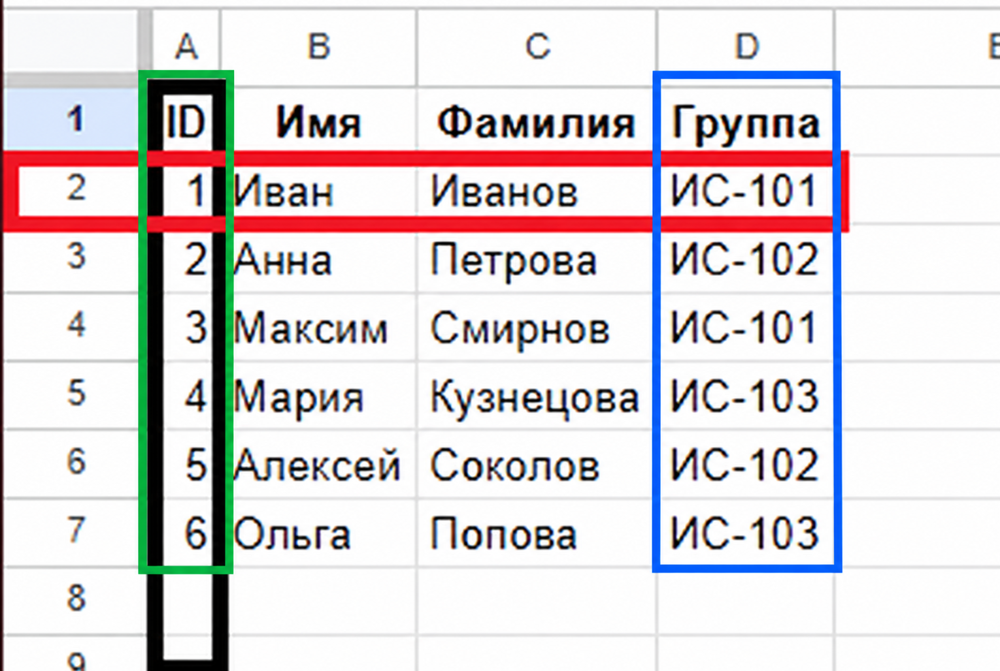
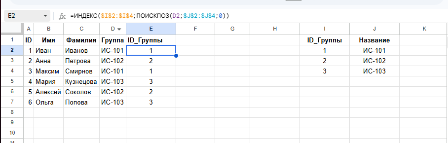

# Домашние задание № 3

## Что нужно сделать

**Практическая работа «Основы баз данных»**

**Цель:** Закрепить понимание основных понятий баз данных: данные и информация, СУБД, модели данных, реляционная модель, ключи и таблицы.

### 1. Зачем нужны базы данных

- Приведи 3 примера использования баз данных в реальной жизни (например, банк, университет, библиотека).
- Напиши, какую пользу база данных приносит в каждом случае (например, ускоряет поиск, хранит большие объёмы информации).

### 2. Данные и информация

- Напиши, чем **данные** отличаются от **информации** своими словами.
- Приведи 2 примера:

  1. Пример данных → пример, как эти данные превращаются в информацию.
  2. Пример из своей жизни или окружающей среды.

### 3. Базы данных и СУБД

- Напиши определение: что такое **база данных**, а что такое **СУБД**.
- Приведи 2 преимущества СУБД перед простыми файлами (например, Excel, текстовые файлы).

### 4. Модели данных

- Напиши коротко, что такое:

  - Иерархическая модель
  - Сетевая модель
  - Реляционная модель (сделай акцент)
  - Объектная модель

- Для каждой модели придумай короткий наглядный пример (например, дерево компании для иерархической).
- Объясни, почему реляционная модель самая популярная.

### 5. Основные элементы реляционной модели

- Нарисуй **таблицу студентов** (5–6 человек), с колонками: ID, Имя, Фамилия, Группа.
- Определи:

  - Что является **строкой**
  - Что является **столбцом**
  - Какой столбец может быть **первичным ключом**. Почему?
  - Какой столбец может быть **внешним ключом**. Почему?

### 6. «Студенты и группы»

- Создай отдельную таблицу «Группы» (3–4 группы).
- Свяжи её с таблицей студентов через ID_Группы.
- Ответь на вопросы:

  1. Как узнать, к какой группе принадлежит студент?
  2. Почему связь через ключи важна?
  3. Что будет, если первичного ключа не будет?
  4. Что будет, если внешнего ключа не будет?
  5. Как таблицы помогают хранить данные организованно?

## Решение 

### 1. Зачем нужны базы данных

- **Банк:** хранит счета и переводы, помогает быстро узнать баланс.
- **Университет:** хранит данные студентов и оценки, упрощает поиск о студенте.
- **Библиотека:** хранит список книг и читателей, помогает узнать, у кого находится книга.

### 2. Данные и информация

**Данные** — отдельные факты. **Информация** — понятный результат обработки этих фактов.

1. Оценки 4, 5, 3 — данные. Средняя оценка 4 — информация.
2. Записи моих расходов за неделю — данные. Общая сумма расходов за неделю — информация.

### 3. Базы данных и СУБД

**База данных** — организованный набор связанных данных.
**СУБД** — программа для создания базы данных и работы с ней.

Преимущества СУБД перед простыми файлами:

- Несколько пользователей могут одновременно работать с данными.
- Можно задавать правила, которые защищают данные от ошибок, например запрещать повторяющиеся ID.

### 4. Модели данных

- **Иерархическая:** данные устроены как дерево, у каждого дочернего элемента один родитель. Пример: компания -> отделы -> сотрудники.
- **Сетевая:** у элемента может быть несколько родителей и связей. Пример: сотрудники участвуют в нескольких проектах, а в каждом проекте несколько сотрудников.
- **Реляционная:** данные хранятся в таблицах со строками и столбцами. Таблицы связаны через ключи. Пример: таблицы «Студенты» и «Группы», связанные по ID группы.
- **Объектная:** данные хранятся как объекты со свойствами и действиями. Пример: объект «Автомобиль» с цветом, скоростью и действием «ехать».

Реляционная модель популярна, потому что таблицы легко понять, связывать и искать в них данные с помощью SQL.

### 5. Основные элементы реляционной модели

- **Чёрный прямоугольник** — столбец.
- **Красный прямоугольник** — строка.
- **Зелёный прямоугольник** — первичный ключ ID. Он уникален для каждого студента.
- **Синий прямоугольник** — внешний ключ «Группа». Он связывает студента с группой

### 6. «Студенты и группы»

1. По ID_Группы студента найти такой же ID в таблице «Группы».
2. Ключи связывают таблицы и помогают избежать неверных связей.
3. Без первичного ключа нельзя гарантировать уникальность записи, и могут появиться дубликаты.
4. Без внешнего ключа можно, невозможно будет связать таблицы.
5. В каждой строке хранится одна запись, а в каждом столбце — один вид данных. Так данные проще искать и изменять.

<a href="../../.github/data/lesson_03/Дз-бд.xlsx" download>Скачать решение в Excel</a>

